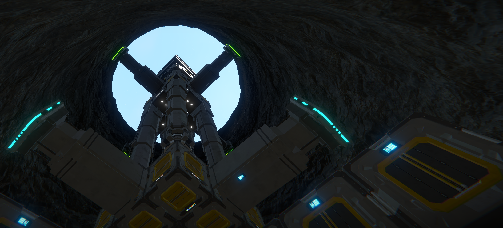
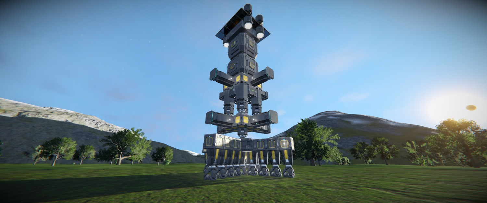
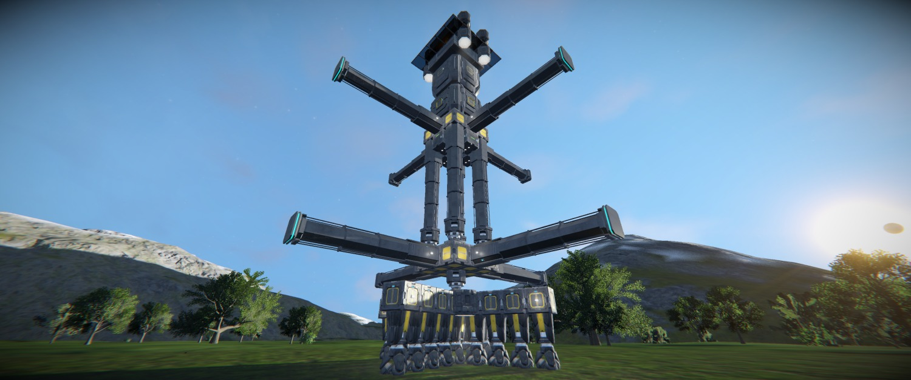
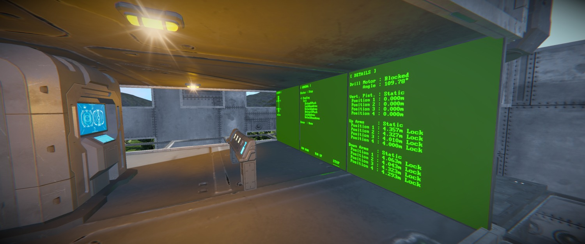
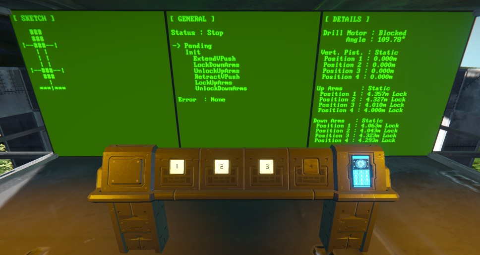

# Space Engineers - Shaft Boring Machine

A Vertical Pistons Based Miner. Run on script.

<div align="center">

</div>

My goal was to build a machine that was able to mine straight downward without player action.

Also I didn't want to use Hydrogen/Atmospheric thrusters because of the size, weight and consumption.

I choose to use pistons in order to "grab" the rock wall and climb down to mine or climb up to get back the machine.

This machine is named "Shaft Boring Machine" and use C# script to run. This is also my first attempt to programming in Space Engineers. We will see code later...

<div align="center">

</div>

<div align="center">

</div>

I did built a cockpit on top of it.

With 3 active buttons on command panel, the first to loop down, the second to loop up and the last one to stop the machine.

The first screen, on the left, show a sketch of the Shaft Boring Machine and which part is currently moving. The second one show which is the current step into the loop.

Finally, the third one show details about drill's motor, vertical pistons and horizontal arms.

<div align="center">

</div>

<div align="center">

</div>

The script contain some features (not exhaustive):

- Checking drill motor rotation speed in case the drill head got stuck in rock.

```csharp
void IsDrillMotorBlocked()
{
    if (Math.Abs((this.drillMotor.Angle * (180/PI)) - this.lastDrillMotorAngle) < minimumDrillRotorRotationPerExecution)
    {
        this.lastDrillMotorAngle = this.drillMotor.Angle * (180/PI);
        this.isDrillMotorBlocked = true;
    }
    else
    {
        this.lastDrillMotorAngle = this.drillMotor.Angle * (180/PI);
        this.isDrillMotorBlocked = false;
    }
}
```

In this case, the machine will retract vertical pistons until drill head rotate again.

- Avoid offset between vertical pistons

```csharp
void VPistonHeightCorrection()
{
    float referencePistonPosition = 0.0f;
    for (int i = 0; i < this.verticalPushPistons.Count; ++i)
    {
        if (i == 0)
        {
            referencePistonPosition = this.verticalPushPistons[i].CurrentPosition;
        }
        else if (this.verticalPushPistons[i].CurrentPosition - referencePistonPosition > 0.1f)
        {
            this.SetPistonMovement(
                this.verticalPushPistons[0],
                PistonMovement.Stop,
                vPistonsExpandSpeed,
                vPistonsExpandMaxImpulseAxis,
                vPistonsExpandMaxImpulseNonAxis);
            this.SetPistonMovement(
                this.verticalPushPistons[i],
                PistonMovement.Retract,
                vPistonsExpandSpeed,
                vPistonsExpandMaxImpulseAxis,
                vPistonsExpandMaxImpulseNonAxis);
        }
        else if (this.verticalPushPistons[i].CurrentPosition - referencePistonPosition < -0.1f)
        {
            this.SetPistonMovement(
                this.verticalPushPistons[0],
                PistonMovement.Stop,
                vPistonsExpandSpeed,
                vPistonsExpandMaxImpulseAxis,
                vPistonsExpandMaxImpulseNonAxis);
            this.SetPistonMovement(
                this.verticalPushPistons[i],
                PistonMovement.Extend,
                vPistonsExpandSpeed,
                vPistonsExpandMaxImpulseAxis,
                vPistonsExpandMaxImpulseNonAxis);
        }
    }
}
```

Based on the first pistons, if the others one got an offset, they will be extanded or retracted.

- Wait for all arms to be locked on rock walls.

```csharp
bool CheckMagneticPlates(EArms arms)
{
    switch (arms)
    {
        case EArms.UpArms: 
        {
            int locked = 0;
            for (int i = 0; i < this.armsUpMagneticPlates.Count; ++i)
            {
                if (this.armsUpMagneticPlates[i].LockMode == LandingGearMode.Locked) 
                {
                    ++locked;
                }
            }
            return locked >= minimumArmLocked;
        }
        case EArms.DownArms:
        {
            int locked = 0;
            for (int i = 0; i < this.armsDownMagneticPlates.Count; ++i)
            {
                if (this.armsDownMagneticPlates[i].LockMode == LandingGearMode.Locked) 
                {
                    ++locked;
                }
            }
            return locked >= minimumArmLocked;
        }
        default:
            return false;
    }
}
```

Based on Magnetic Plates locking system, it wait for the 4 arms to be locked before continuing procedure.

The script is not perfect and the physics engine of SE get sometime crazy but it's a good start I think.

Space Engineers World (Steam Workshop) :  
https://steamcommunity.com/sharedfiles/filedetails/?id=2848635714 